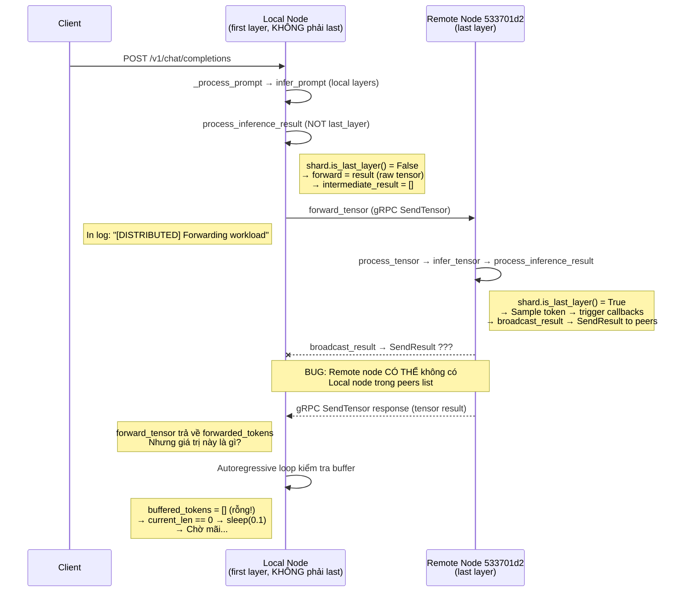

# Kế hoạch sửa lỗi: Chat model bị treo khi chạy phân tán

## Hiện tượng quan sát

Khi gửi request chat `POST /v1/chat/completions`:

```
[INFO] Request data received: model=qwen2.5:1.5b, stream=False, messages_count=1
[DISTRIBUTED] Forwarding workload to Node: 533701d2-bb6a-4aa7-b93f-f8e9e96b42e2
[DISTRIBUTED] Forwarding workload to Node: 533701d2-bb6a-4aa7-b93f-f8e9e96b42e2
[DISTRIBUTED] Forwarding workload to Node: 533701d2-bb6a-4aa7-b93f-f8e9e96b42e2
... (lặp lại mỗi ~5s cho đến khi timeout)
```

- **Không** thấy log `[LAST_LAYER]` hay `[CALLBACK]` → token không bao giờ được tạo ra phía local.
- Client bị `Connection aborted` (server timeout middleware trả 408 hoặc đóng kết nối).
- Autoregressive loop chờ mãi ở dòng 375-388 (sleep 0.1 + check buffer rỗng).

---

## Phân tích flow phân tán



---

## Nguyên nhân gốc rễ

### Bug 1 (CRITICAL): Autoregressive loop không nhận token từ `forward_tensor` return value

**File**: [node.py dòng 261-277](file:///d:/CODE/test/nckh/synapse_ai/synapse/orchestration/node.py#L261-L277)

Khi local node **KHÔNG phải last layer**, `process_inference_result` đi vào nhánh else (dòng 261):
```python
else:  # NOT last_layer
    forward = result        # Raw tensor — chưa sample token
    intermediate_result = [] # Rỗng!

# Forward tensor to next partition
if not shard.is_last_layer():
    forwarded_tokens = await self.forward_tensor(...)
    if forwarded_tokens is not None and forwarded_tokens.size > 0:
        self._on_token_received(request_id, forwarded_tokens.flatten().tolist(), False)
    return forwarded_tokens
```

**Vấn đề**: `forward_tensor` gọi `target_peer.send_tensor()` (gRPC), remote node xử lý rồi trả response. Response gRPC là kết quả `process_tensor` từ remote. Khi remote là **last layer**:
- Remote gọi `process_inference_result` → sample token → buffer token → `trigger_on_token_callbacks` → `broadcast_result`  
- Nhưng `process_inference_result` return value tại remote là `np.array(buffered_tokens)` (dòng 292) — đó là array of int tokens
- Response gRPC truyền bytes → local nhận `forwarded_tokens` → gọi `_on_token_received(forwarded_tokens.flatten().tolist())` 

**Tuy nhiên**, có một vấn đề nghiêm trọng: `process_inference_result` chỉ return token array khi `is_finished = True` (dòng 286-292). Khi chưa finished:
```python
# dòng 278-284 (last_layer, NOT finished)
self.trigger_on_token_callbacks(request_id, intermediate_result, is_finished)
if intermediate_result or is_finished:
    self._schedule_task(self.broadcast_result(...))
# Không có return! → return None implicitly
```

→ `forwarded_tokens = None` → `_on_token_received` KHÔNG được gọi → buffer rỗng → autoregressive loop chờ mãi.

### Bug 2 (CRITICAL): `process_inference_result` không return token cho từng step ở last_layer

Khi shard IS last_layer và chưa finished (dòng 278-284):
```python
self.trigger_on_token_callbacks(request_id, intermediate_result, is_finished)
if intermediate_result or is_finished:
    self._schedule_task(self.broadcast_result(...))
# ← KHÔNG CÓ RETURN! Python trả implicit None
```

Hàm này không `return` gì khi token được tạo ra nhưng chưa finished. Gọi từ `forward_tensor` → `send_tensor` → gRPC → remote `process_tensor` → `process_inference_result` return None → gRPC response trả tensor rỗng → local nhận None.

### Bug 3 (MODERATE): `broadcast_result` có thể không đến local node

Remote node gọi `broadcast_result` gửi `SendResult` cho tất cả `self.peers`, nhưng:
- Remote node tìm peers bằng `self.discovery.discover_peers()`
- Nếu **remote node không thấy local node** trong Tailscale discovery (hoặc dedup xóa mất), `SendResult` sẽ KHÔNG được gửi đến local node
- Ngay cả nếu gửi thành công, `SendResult` → `on_token.trigger_all` → `_on_token_received` cập nhật buffer → nhưng **autoregressive loop đang await `process_tensor`**, chưa check buffer

### Bug 4 (DESIGN): Autoregressive loop chờ buffer update, nhưng `process_tensor` là blocking call

Autoregressive loop (dòng 367-403):
```python
while True:
    buffered_tokens, finished = self.buffered_token_output.get(request_id, ([], False))
    current_len = len(buffered_tokens)
    if finished: break
    if current_len == 0 or current_len == prev_len:
        await asyncio.sleep(0.1)  # Chờ callback cập nhật buffer
        continue
    # ← Chỉ đến đây khi buffer có token MỚI
    last_token = np.array([[tokens[-1]]])
    latest_result = await self.process_tensor(base_shard, last_token, request_id, ...)
    #                    ↑ BLOCKING! forward_tensor → gRPC call → chờ remote
    #                    → process_inference_result return None (bug 2)
    #                    → loop lặp → sleep(0.1) → chờ buffer update → nhưng không bao giờ có!
```

---

## Kế hoạch sửa

### Bước 1: Sửa `process_inference_result` — phải return token khi last_layer

**File**: [node.py dòng 278-292](file:///d:/CODE/test/nckh/synapse_ai/synapse/orchestration/node.py#L278-L292)

**Thay đổi**: Khi shard là last_layer, luôn trả `token.reshape(1, -1)` cho dù chưa finished, để gRPC response mang token về local node.

```diff
    else:  # IS last_layer
      if DEBUG >= 1:
        print(f"[{request_id}] [LAST_LAYER] Triggering callback: tokens={intermediate_result}, is_finished={is_finished}")
      self.trigger_on_token_callbacks(request_id, intermediate_result, is_finished)
      
      if intermediate_result or is_finished:
        self._schedule_task(self.broadcast_result(request_id, intermediate_result, is_finished), name=f"broadcast_{request_id}")
    
      if is_finished:
        if request_id in self.buffered_token_output:
          self.buffered_token_output[request_id] = (self.buffered_token_output[request_id][0], True)
        self.outstanding_requests.pop(request_id, None)
        self._prompt_token_ids.pop(request_id, None)
    
        return np.array(self.buffered_token_output.get(request_id, ([], False))[0])
+
+     # Trả token đã sample để gRPC response mang về local node
+     return forward  # token.reshape(1, -1)
```

**Kiểm chứng**: Log thêm ở `forward_tensor` kết quả → `forwarded_tokens` phải là int array, KHÔNG phải None.

---

### Bước 2: Sửa `forward_tensor` — xử lý token result từ last_layer

**File**: [node.py dòng 265-277](file:///d:/CODE/test/nckh/synapse_ai/synapse/orchestration/node.py#L265-L277)

Khi `forward_tensor` nhận result từ remote last_layer, kết quả là token (1D int array) thay vì tensor. Cần phân biệt:

```diff
    if not shard.is_last_layer():
      self.outstanding_requests[request_id] = "waiting"
      forwarded_tokens = await self.forward_tensor(...)
      if forwarded_tokens is not None and forwarded_tokens.size > 0:
-       self._on_token_received(request_id, forwarded_tokens.flatten().tolist(), False)
+       # Kết quả từ remote last_layer: token ID array
+       token_list = forwarded_tokens.flatten().tolist()
+       self._on_token_received(request_id, token_list, False)
      return forwarded_tokens
```

Phần này thực ra đã đúng logic. Vấn đề chính là Bug 1+2: `forwarded_tokens` là None vì remote không return gì.

---

### Bước 3: Sửa autoregressive loop — dùng token từ `process_tensor` return

**File**: [node.py dòng 399-403](file:///d:/CODE/test/nckh/synapse_ai/synapse/orchestration/node.py#L399-L403)

Sau khi fix Bug 1+2, `process_tensor` → `process_inference_result` → `forward_tensor` → remote trả token → `_on_token_received` cập nhật buffer → loop sẽ detect token mới. Nhưng cần đảm bảo `process_tensor` return value cũng được xử lý:

```diff
          prev_len = current_len
          last_token = np.array([[tokens[-1]]])
          
          # Continue autoregressive loop
          latest_result = await self.process_tensor(base_shard, last_token, request_id, inference_state)
+         # Nếu result chứa token từ remote (last_layer), cập nhật buffer
+         # (đã được xử lý trong process_inference_result → forward_tensor → _on_token_received)
+         wait_start = time.perf_counter()  # Reset watchdog sau mỗi progress
```

---

### Bước 4: Thêm `is_finished` detection từ remote response

**File**: [node.py dòng 265-277](file:///d:/CODE/test/nckh/synapse_ai/synapse/orchestration/node.py#L265-L277)

Khi remote trả token với `is_finished=True`, local cần biết để dừng loop. Hiện tại `_on_token_received` chỉ set `is_finished` flag nếu remote gửi via `broadcast_result` → `SendResult`. Nhưng nếu dùng gRPC response trực tiếp, cần thêm mechanism.

**Option A (đơn giản nhất)**: Dựa vào gRPC response từ `SendTensor`. Khi remote `process_inference_result` trả token array (finished), response sẽ chứa full token buffer → local nhận và set finished.

**Option B**: Encode finished flag vào gRPC response metadata.

→ Chọn **Option A** vì đơn giản nhất: Token buffer cuối cùng từ remote sẽ chứa EOS token, local loop detect EOS → break.

---

## Tóm tắt thứ tự thực hiện

| Bước | File | Mục tiêu | Kiểm chứng |
|------|------|----------|-------------|
| 1 | `node.py` L278-292 | `process_inference_result` return token khi last_layer chưa finished | Log `forwarded_tokens` != None |
| 2 | `node.py` L265-277 | Verify `_on_token_received` được gọi đúng | Log buffer có token sau forward |
| 3 | `node.py` L399-403 | Reset watchdog sau mỗi progress | Không thấy watchdog log |
| 4 | `node.py` L265-277 | Detect finished từ remote response | Loop break đúng thời điểm |

> [!IMPORTANT]
> **Bước 1 là quan trọng nhất** — nó giải quyết trực tiếp bug `process_inference_result` return None khi last_layer chưa finished, khiến toàn bộ pipeline phân tán bị treo.

> [!WARNING]
> Có thêm vấn đề phụ: `broadcast_result` từ remote node có thể không đến local node nếu remote không thấy local trong peers. Tuy nhiên, fix Bước 1 sẽ **bypass** cơ chế broadcast hoàn toàn — token trả về trực tiếp qua gRPC response.
